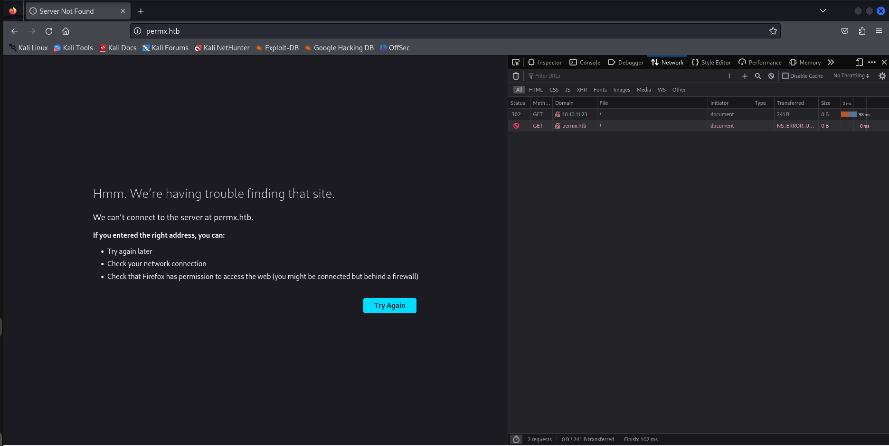

# HackTheBox - PermX [Linux, Easy]

## Scanning with Nmap
`nmap -A -T4 -vvv -oN nmapscan <IP-ADDRESS>`

```
──(kali㉿kali)-[~]
└─$ nmap -A -T4 -vvv -oN nmapscan 10.10.11.23
Starting Nmap 7.94SVN ( https://nmap.org ) at 2024-07-21 10:19 EDT
NSE: Loaded 156 scripts for scanning.
NSE: Script Pre-scanning.
NSE: Starting runlevel 1 (of 3) scan.
Initiating NSE at 10:19
Completed NSE at 10:19, 0.00s elapsed
NSE: Starting runlevel 2 (of 3) scan.
Initiating NSE at 10:19
Completed NSE at 10:19, 0.00s elapsed
NSE: Starting runlevel 3 (of 3) scan.
Initiating NSE at 10:19
Completed NSE at 10:19, 0.00s elapsed
Initiating Ping Scan at 10:19
Scanning 10.10.11.23 [2 ports]
Completed Ping Scan at 10:19, 0.05s elapsed (1 total hosts)
Initiating Parallel DNS resolution of 1 host. at 10:19
Completed Parallel DNS resolution of 1 host. at 10:19, 0.02s elapsed
DNS resolution of 1 IPs took 0.02s. Mode: Async [#: 1, OK: 0, NX: 1, DR: 0, SF: 0, TR: 1, CN: 0]
Initiating Connect Scan at 10:19
Scanning 10.10.11.23 [1000 ports]
Discovered open port 80/tcp on 10.10.11.23
Discovered open port 22/tcp on 10.10.11.23
Completed Connect Scan at 10:19, 1.88s elapsed (1000 total ports)
Initiating Service scan at 10:19
Scanning 2 services on 10.10.11.23
Completed Service scan at 10:19, 6.18s elapsed (2 services on 1 host)
NSE: Script scanning 10.10.11.23.
NSE: Starting runlevel 1 (of 3) scan.
Initiating NSE at 10:19
Completed NSE at 10:19, 2.17s elapsed
NSE: Starting runlevel 2 (of 3) scan.
Initiating NSE at 10:19
Completed NSE at 10:19, 0.23s elapsed
NSE: Starting runlevel 3 (of 3) scan.
Initiating NSE at 10:19
Completed NSE at 10:19, 0.01s elapsed
Nmap scan report for 10.10.11.23
Host is up, received syn-ack (0.11s latency).
Scanned at 2024-07-21 10:19:35 EDT for 11s
Not shown: 998 closed tcp ports (conn-refused)
PORT   STATE SERVICE REASON  VERSION
22/tcp open  ssh     syn-ack OpenSSH 8.9p1 Ubuntu 3ubuntu0.10 (Ubuntu Linux; protocol 2.0)
| ssh-hostkey: 
|   256 e2:5c:5d:8c:47:3e:d8:72:f7:b4:80:03:49:86:6d:ef (ECDSA)
| ecdsa-sha2-nistp256 AAAAE2VjZHNhLXNoYTItbmlzdHAyNTYAAAAIbmlzdHAyNTYAAABBBAyYzjPGuVga97Y5vl5BajgMpjiGqUWp23U2DO9Kij5AhK3lyZFq/rroiDu7zYpMTCkFAk0fICBScfnuLHi6NOI=
|   256 1f:41:02:8e:6b:17:18:9c:a0:ac:54:23:e9:71:30:17 (ED25519)
|_ssh-ed25519 AAAAC3NzaC1lZDI1NTE5AAAAIP8A41tX6hHpQeDLNhKf2QuBM7kqwhIBXGZ4jiOsbYCI
80/tcp open  http    syn-ack Apache httpd 2.4.52
|_http-server-header: Apache/2.4.52 (Ubuntu)
| http-methods: 
|_  Supported Methods: GET HEAD POST OPTIONS
|_http-title: Did not follow redirect to http://permx.htb
Service Info: Host: 127.0.1.1; OS: Linux; CPE: cpe:/o:linux:linux_kernel

NSE: Script Post-scanning.
NSE: Starting runlevel 1 (of 3) scan.
Initiating NSE at 10:19
Completed NSE at 10:19, 0.00s elapsed
NSE: Starting runlevel 2 (of 3) scan.
Initiating NSE at 10:19
Completed NSE at 10:19, 0.00s elapsed
NSE: Starting runlevel 3 (of 3) scan.
Initiating NSE at 10:19
Completed NSE at 10:19, 0.00s elapsed
Read data files from: /usr/bin/../share/nmap
Service detection performed. Please report any incorrect results at https://nmap.org/submit/ .
Nmap done: 1 IP address (1 host up) scanned in 11.14 seconds
```
We see ports `80` and `22` are open.

## Update Hosts File

Upon visiting `10.10.11.23` in the browser, we get a redirect to `http://permx.htb`



So we add `permx.htb` to our hosts file.

```
┌──(kali㉿kali)-[/etc]
└─$ cat /etc/hosts
10.10.11.23     permx.htb

127.0.0.1       localhost
127.0.1.1       kali
::1             localhost ip6-localhost ip6-loopback
ff02::1         ip6-allnodes
ff02::2         ip6-allrouters
```

And now we can view `permx.htb` in the browser:


